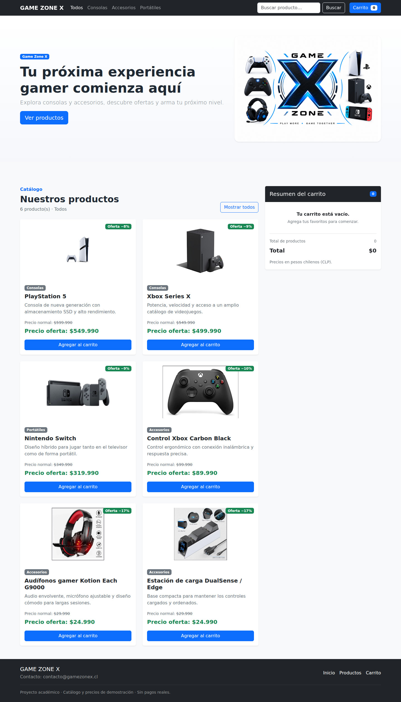
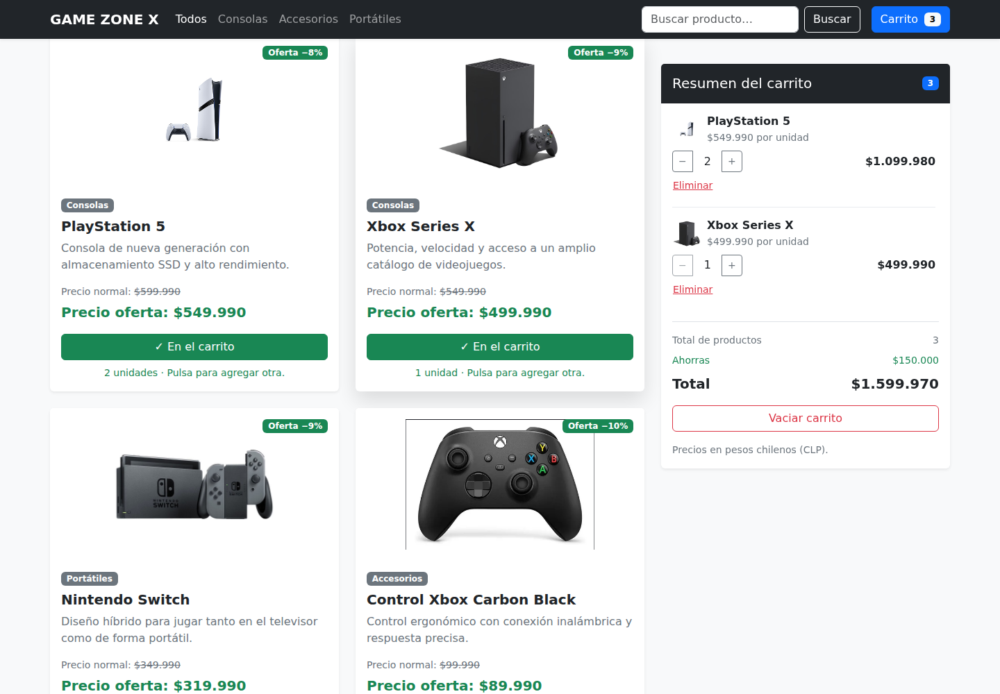
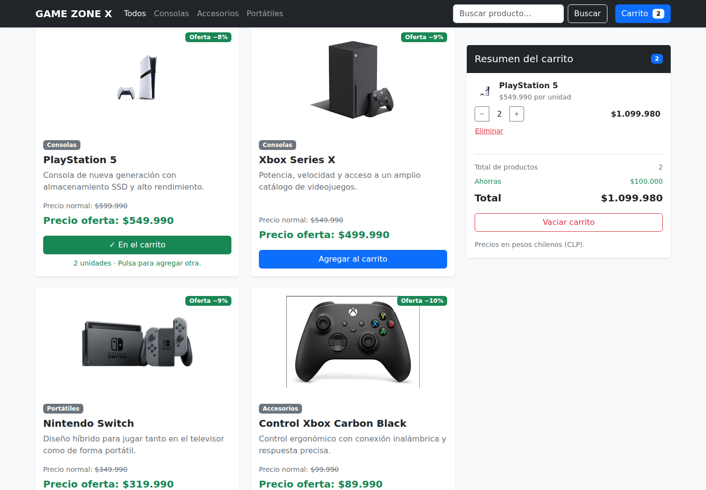
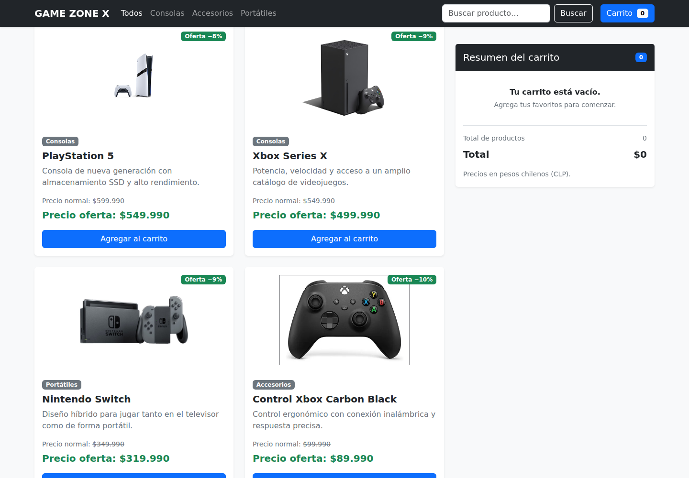
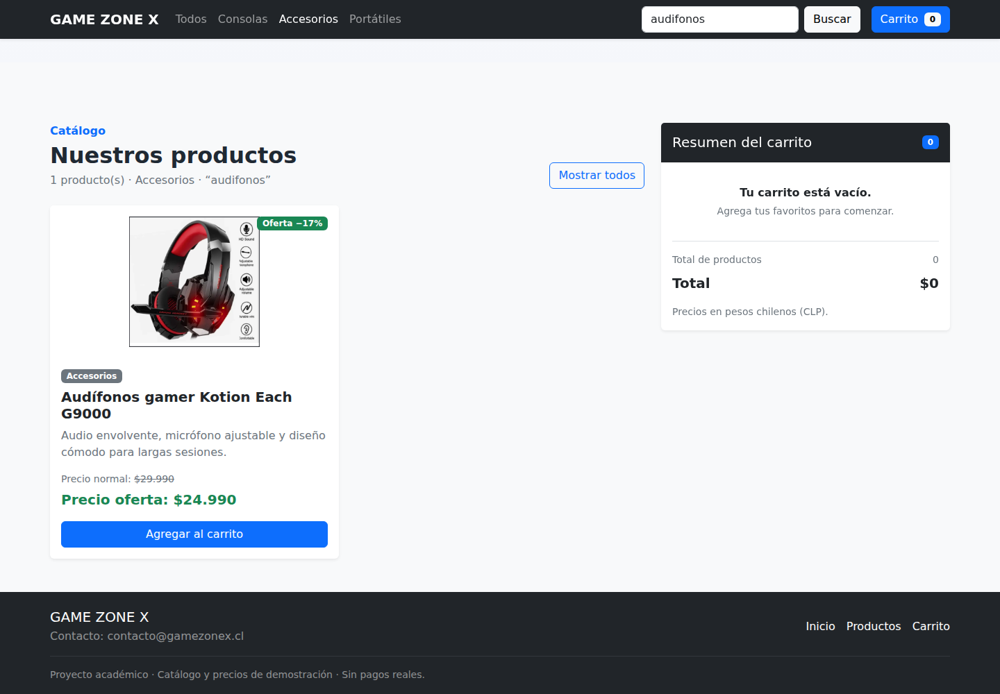
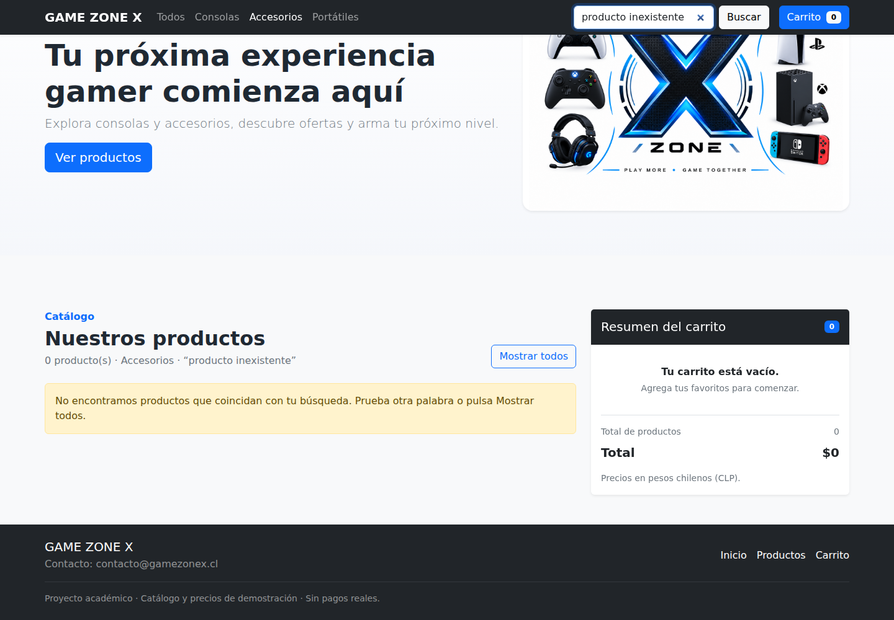
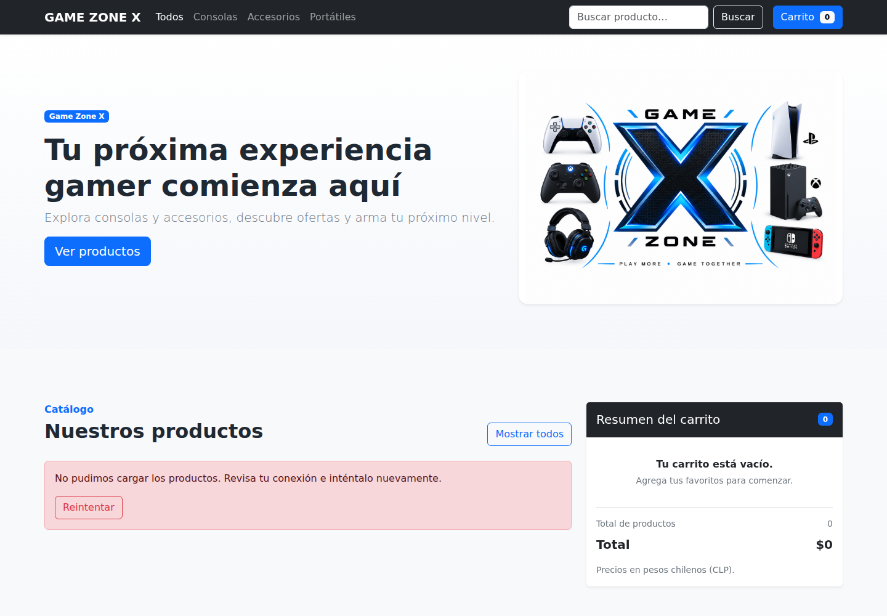
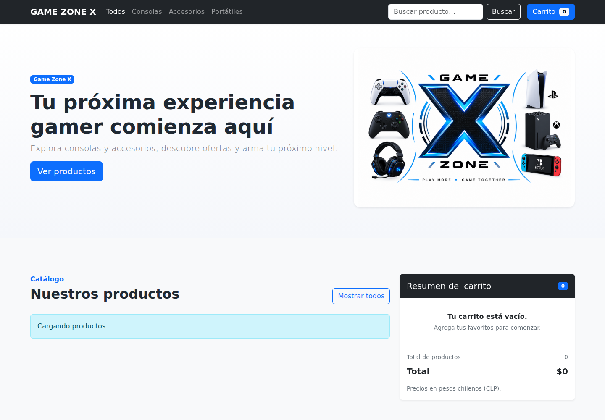
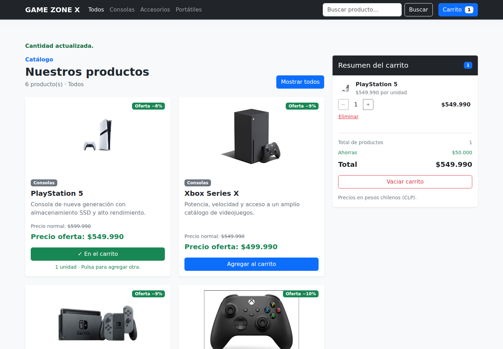

# Evidencias de Semana 8

Capturas reales de Chromium durante la suite de GitHub Actions. Los casos de carga y error controlan la petición para mostrar estados transitorios.

## Catálogo cargado dinámicamente

Seis productos desde JSON, imágenes, precios y carrito inicial vacío.

## Productos agregados

Dos PS5 y un Xbox: contador 3, total $1.599.970 y ahorro $150.000.

## Producto eliminado

Xbox eliminado: dos PS5, contador 2 y total $1.099.980. El botón del Xbox se restaura.

## Carrito vacío

Mensaje vacío, contador 0, total $0 y botones de agregar restaurados.

## Categoría y búsqueda

Accesorios y búsqueda audifonos: un resultado.

## Sin resultados

Mensaje condicional cuando no hay coincidencias.

## Error y reintento

HTTP 503 simulado y botón Reintentar. La prueba también verifica recuperación.

## Carga pendiente

Mensaje antes de recibir el JSON; luego se verifica la actualización del catálogo.

## Vista móvil

Menú responsive, filtro y carrito sin desborde horizontal.

## Botón condicional

PS5 con botón verde ✓ En el carrito y cantidad; Xbox ausente con botón azul.

